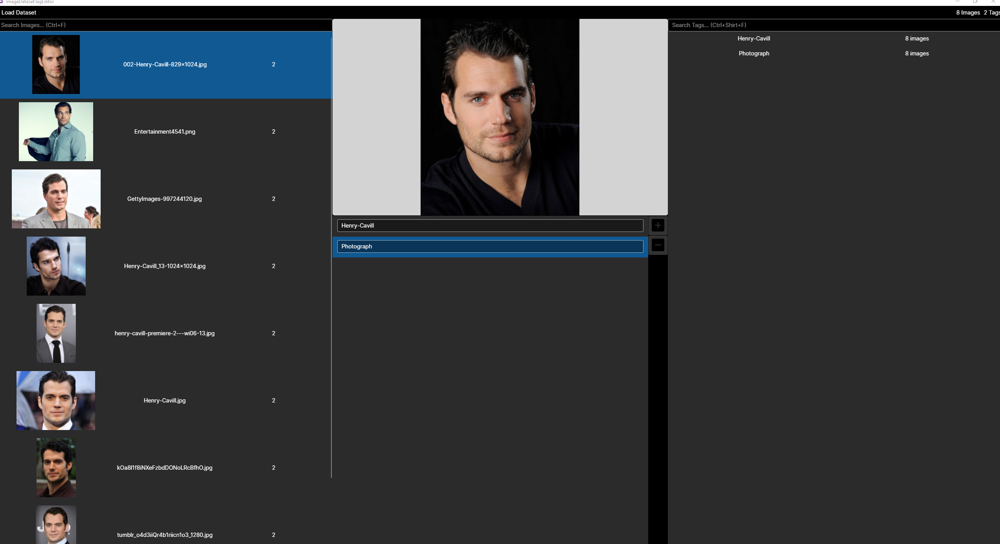
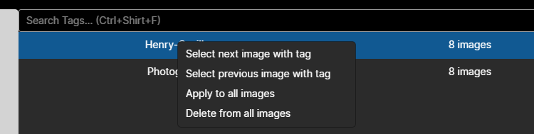

# ImageDataSetTagEditor

A small desktop application to manage image tag captions for image training, written in C#
and [AvaloniaUI](https://avaloniaui.net/).
This project is heavily inspired by [BooruDatasetTagManager](https://github.com/starik222/BooruDatasetTagManager) and
has many of its features, including auto-complete of already used tags.

Can manage a dataset in subdirectories, where each caption is split into tags or just comma separated values.
These captions are put into a text file next to the image, named the same way. So image `0000.jpg` has a caption
file `0000.txt` with something like `person, woman, sitting on a chair`.

## Screenshots and differences to BooruDatasetTagManager

1. There isn't really a concept of keeping changes before saving them. As soon as you switch to a different image, the changes get written to the tag text file of the previous image. 
Keeping track of these changes locally and then requiring the user to save the changes didn't really make much sense to me.
2. Tag-Translation isn't present here either. On a very basic level, this application is just there to write comma seperated values into text files that belong to an image. It doesn't matter what these values are or in what language they are.
But to keep some consistency, I've added the global tag overview and auto-complete of tags.
3. The entire feature of BooruDatasetTagManager with the **loss statistics** isn't present here. I wrote this application for my personal needs and I've never used those statistics.

#### Overview

#### Tag Context Menu

## Running

Just head over to the [releases page](https://github.com/TheAnachronism/ImageDataSetTagEditor/releases), grab the latest one and download the executable you need.
Everything of the application is contained in one file, so nothing else is required.
When opening, a console window will appear in the background. That is currently because of .NET and Avalonia, and I haven't figured out yet, how to get it away -.-

## Key bindings and other features

As I often accelerate my work with key bindings, I've added some here as well:

- Ctrl + Down: Select next image
- Ctrl + Up: Select previous image
- Ctrl + F: Enter image search box
- Ctrl + Shift + F: Enter tag search box
- Ctrl + Add(+): Add tag to current selected image
- Ctrl + Subtract(-): Delete current selected tag on current selected image
- Up & Down: Select the next or previous tag of the current image. Also includes auto-complete suggestions if they're shown.

Clicking on the tag list on the right also cycles through the images that have the clicked tag.

## Local development setup

Clone the repo and open the solution, just make sure you have .NET 7 installed and the IDE extension needed to develop Avalonia.